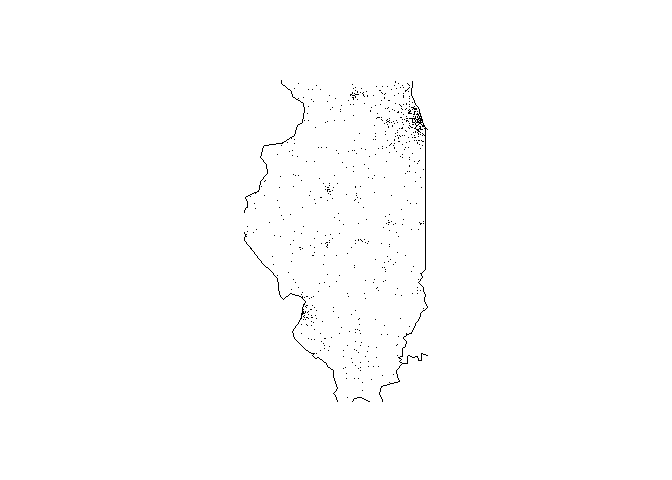

<!-- README.md is generated from README.Rmd. Please edit that file -->

# fars

<!-- badges: start -->
<!-- badges: end -->

The purpose of the fars package is to better read, summarize, and
display data retrieved from the Fatality Analysis Reporting System. This
includes providing functions that simplify the process of reading across
multiple years’ traffic fatality data sets. In addition the package
provides a function to plot a year’s data geographically by state.

The following functions are provided by the fars package:

- **fars_read :** a function for reading in fars data as a csv file.

- **make_filename :** a function for creating fars data filenames from
  an inputted year.

- **fars_read_years :** a function for reading in multiple years of fars
  data.

- **fars_summarize_years :** a function for summarizing multiple years
  of fars data by fatalities per month each year.

- **fars_map_state :** a function for graphically displaying fars data
  on a map of a specified U.S. state.

## Installing & Loading the Package

In order to use the fars package, it will first need to be installed.
This can be done by running the following line of code:

``` r
#install_github("ckvolle/fars")
```

To load this package into your work space you can run the following:

``` r
library(fars)
```

It’s also useful to load the dplyr function with the following:

``` r
library(dplyr)
```

## fars_read

While doing an analysis on a set of FARS data, it may be useful to have
a function to read in the fars CSV data and convert it to a more
manageable data frame object. This is where the fars_read function comes
in handy. If you wanted to read in the file “accident_2013.csv.bz2” you
could use the fars_read function:

``` r
fars_read("accident_2013.csv.bz2")
#> # A tibble: 30,202 × 50
#>    STATE ST_CASE VE_TOTAL VE_FORMS PVH_INVL  PEDS PERNOTMVIT PERMVIT PERSONS
#>    <dbl>   <dbl>    <dbl>    <dbl>    <dbl> <dbl>      <dbl>   <dbl>   <dbl>
#>  1     1   10001        1        1        0     0          0       8       8
#>  2     1   10002        2        2        0     0          0       2       2
#>  3     1   10003        1        1        0     0          0       1       1
#>  4     1   10004        1        1        0     0          0       3       3
#>  5     1   10005        2        2        0     0          0       3       3
#>  6     1   10006        2        2        0     0          0       3       3
#>  7     1   10007        1        1        0     0          0       1       1
#>  8     1   10008        2        2        0     0          0       2       2
#>  9     1   10009        1        1        0     0          0       1       1
#> 10     1   10010        2        2        0     0          0       4       4
#> # ℹ 30,192 more rows
#> # ℹ 41 more variables: COUNTY <dbl>, CITY <dbl>, DAY <dbl>, MONTH <dbl>,
#> #   YEAR <dbl>, DAY_WEEK <dbl>, HOUR <dbl>, MINUTE <dbl>, NHS <dbl>,
#> #   ROAD_FNC <dbl>, ROUTE <dbl>, TWAY_ID <chr>, TWAY_ID2 <chr>, MILEPT <dbl>,
#> #   LATITUDE <dbl>, LONGITUD <dbl>, SP_JUR <dbl>, HARM_EV <dbl>,
#> #   MAN_COLL <dbl>, RELJCT1 <dbl>, RELJCT2 <dbl>, TYP_INT <dbl>,
#> #   WRK_ZONE <dbl>, REL_ROAD <dbl>, LGT_COND <dbl>, WEATHER1 <dbl>, …
```

## make_filename

Traffic accident fatality data from FARS follows a common structure
“accident_year.csv.bz2”. To avoid typing out the entire filename it may
be helpful to use the make_filename function. This function takes a year
as a character string, integer, or whole-number numeric, and returns a
character string that gives the filename for that year’s data. If you
wanted to read in a FARS data set in as a data frame you could use this
function in combination to the fars_read function as follows:

``` r
fars_read(make_filename(2013))
#> # A tibble: 30,202 × 50
#>    STATE ST_CASE VE_TOTAL VE_FORMS PVH_INVL  PEDS PERNOTMVIT PERMVIT PERSONS
#>    <dbl>   <dbl>    <dbl>    <dbl>    <dbl> <dbl>      <dbl>   <dbl>   <dbl>
#>  1     1   10001        1        1        0     0          0       8       8
#>  2     1   10002        2        2        0     0          0       2       2
#>  3     1   10003        1        1        0     0          0       1       1
#>  4     1   10004        1        1        0     0          0       3       3
#>  5     1   10005        2        2        0     0          0       3       3
#>  6     1   10006        2        2        0     0          0       3       3
#>  7     1   10007        1        1        0     0          0       1       1
#>  8     1   10008        2        2        0     0          0       2       2
#>  9     1   10009        1        1        0     0          0       1       1
#> 10     1   10010        2        2        0     0          0       4       4
#> # ℹ 30,192 more rows
#> # ℹ 41 more variables: COUNTY <dbl>, CITY <dbl>, DAY <dbl>, MONTH <dbl>,
#> #   YEAR <dbl>, DAY_WEEK <dbl>, HOUR <dbl>, MINUTE <dbl>, NHS <dbl>,
#> #   ROAD_FNC <dbl>, ROUTE <dbl>, TWAY_ID <chr>, TWAY_ID2 <chr>, MILEPT <dbl>,
#> #   LATITUDE <dbl>, LONGITUD <dbl>, SP_JUR <dbl>, HARM_EV <dbl>,
#> #   MAN_COLL <dbl>, RELJCT1 <dbl>, RELJCT2 <dbl>, TYP_INT <dbl>,
#> #   WRK_ZONE <dbl>, REL_ROAD <dbl>, LGT_COND <dbl>, WEATHER1 <dbl>, …
```

## fars_read_years

If you were interested in viewing a summary of these years by month and
year, to perhaps analyze patterns in the amount of traffic fatalities,
the fars_summarize_years function provided by the fars package can
provide such a summary. For example, if you were interested in looking
for a pattern indicating that traffic fatalities increase during the
summer months over the years 2013-2015, you could use the
fars_summarize_years function as follows:

``` r
fars_summarize_years(c(2013,2014,2015))
#> # A tibble: 12 × 4
#>    MONTH `2013` `2014` `2015`
#>    <dbl>  <int>  <int>  <int>
#>  1     1   2230   2168   2368
#>  2     2   1952   1893   1968
#>  3     3   2356   2245   2385
#>  4     4   2300   2308   2430
#>  5     5   2532   2596   2847
#>  6     6   2692   2583   2765
#>  7     7   2660   2696   2998
#>  8     8   2899   2800   3016
#>  9     9   2741   2618   2865
#> 10    10   2768   2831   3019
#> 11    11   2615   2714   2724
#> 12    12   2457   2604   2781
```

## fars_map_state

It may also be important to look for patterns in the location of traffic
fatalities, in order to identify high risk areas. This can be
accomplished using the fars_map_state function. This function provides a
map of the selected state, and plots on this map the locations of the
selected year’s traffic fatalities. If you were interested in finding
the “hotspots” for traffic accident fatalities in the state of Illinois
in the year 2013, you use the function as follows:

``` r
fars_map_state(17, 2013)
```


